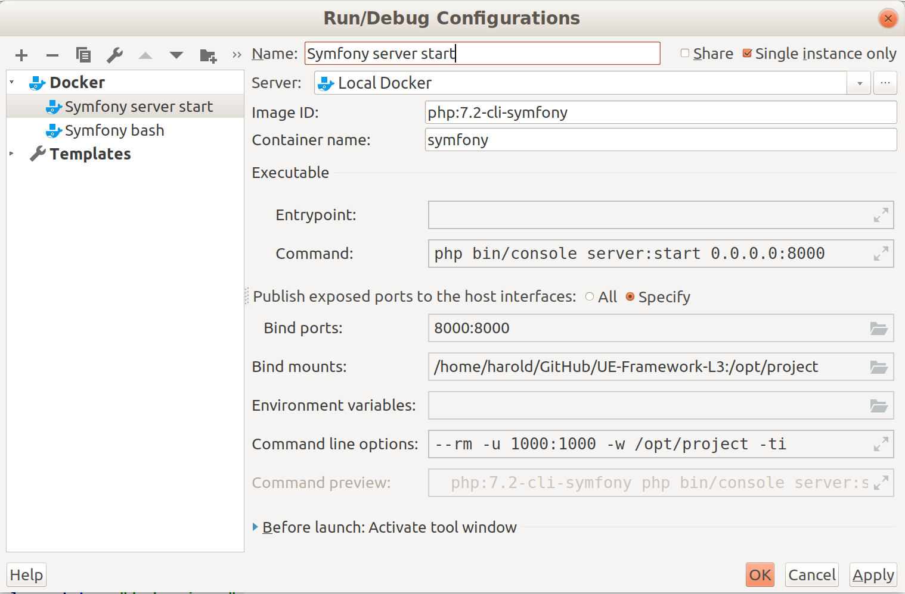
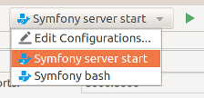
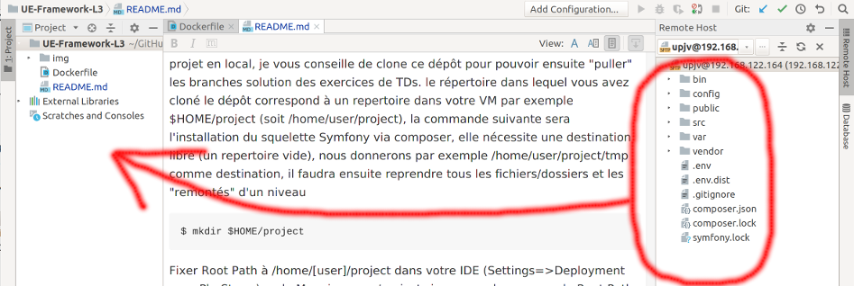
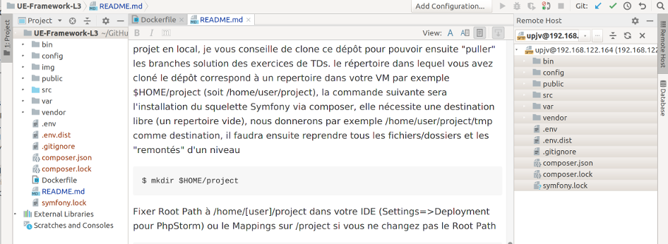
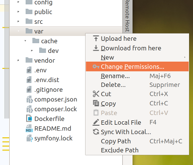

# Support module L3
La première étape a éffectué consiste à installer votre environnement de développement.
Il y a plusieurs façon de le faire, les critères principaux à retenir sont :
- Isolation les actions et développement que vous faites ne doivent pas perturber (poluer) le reste de votre système
- Evolution/Regression, vous devez pouvoir changer de version de librairie de langage en gardant la même architecture.
- Partage/Colaboration, un projet important ne se développement jamais seul et sera repris par d'autre, 
le temps que vous avez passé à configurer ne doit pas être perdu, il faut capitaliser
- Sauvegarde, on est jamais à l'abris d'une panne, votre environnement doit pourvoir se redéployer à partir d'un backup
- Historisation, les choix que vous faites à un moment dans vos développements peut être remis en cause, 
versionnez votre code pour pouvoir revenir en arrière 
### Environnement de Dev sous docker
Le Dockerfile fournit permet de construire une image prête pour installer le framework Symfony. La première étape sera 
de créer un projet et ses dépendances. On choisira par exemple un squelette minimum pour commencer, une approche pédagogique.

    $ docker build -t php-symfony .
    
De cette image vous lancerez la création d'un projet en utilisant un script de composer officiel. En partant d'un projet
vide vous n'auriez rencontrer qucun problème. Mais en partant d'un clone de ce dépôt votre dossier versionné n'est pas 
vide il contient le Dockerfile, le README et le .git, nous allons donc créer le projet dans un nouveau dossier vide 
"project-tmp" par exemple

    $ mkdir project-tmp
        
Sous *nix l'image est exécutée par defaut par l'user root, ajouter l'option -u $UID:$GROUPS pour que le squelette créé
vous appartien

    $ docker run --rm -ti --name symfony -u $UID:$GROUPS -v `pwd`/project-tmp:/opt/project php-symfony composer create-project symfony/skeleton /opt/project
 
Sous Windows remplacer `pwd` par C:\votre_repertoire_de_projet  

    $ docker run --rm -ti --name symfony -v C:\votre_repertoire_de_projet:/opt/project php-symfony composer create-project symfony/skeleton /opt/project/project-tmp

Déplacer l'ensemble du squelette de votre nouveau projet dans le répertoire parent. Vous pouvez maintenant vérifier 
que tout est fonctionnel. Remarquer le chemin choisit pour la localisation du projet dans le contenair docker, "/opt/project"
ce choix n'est pas arbitraire, il reprend le chemin par défault donner dans l'interface de PhpStorm.  
Dernière action lancez votre serveur de dev. Pour quitter un simple ^ctrl c suffit. Pour vérifier connectez vous à 
l'url http://localhost avec votre navigateur.

    $ mv project-tmp/* .; mv project-tmp/.* .;rm -r project-tmp
    $ docker run --rm -p 8000:8000 -ti --name symfony -u $UID:$GROUPS -v `pwd`:/opt/project -w /opt/project php-symfony
    
Optionnellement vous pouvez installer les des outils complémentaires

    $ docker run --rm -p 8000:8000 -ti --name symfony -u $UID:$GROUPS -v `pwd`:/opt/project -w /opt/project php-symfony composer require server --dev
### RUN/DEBUG 
Le container docker créé ci-dessus éxécute par défaut la commande `php -S 0.0.0.0:8000 -t public` en fin de script. Cela
lance le serveur web interne de php sur le port 8000 à l'écoute de toute les interfaces de votre poste de développement, 
(l'option -t indique que la racine des doncuments plubliés et le répertoire _public_). 
C'est suffisant comme configuration pour débuter, cependant symfony propose d'autres outils plus performant pour tester vos 
développements, avec notament la possibilité de mettre en cache le résultat de contruction de page précédents.  
Dans le répertoire bin créé de l'installation du squelette vous trouverez l'outil console. Il vous permettera, par exemple,
de lancer un serveur Web `php bin/console server:start` de vider le cache `php bin/console cache:clear` ou encore plus
sofistiqué de créer une entité `php bin/console generate:doctrine:entity`  
Pour utiliser l'ensemble des outils de symfony un interpreteur de commande est donc nécessaire, lancer uniquement le container
en mode serveur interne est trop limitatif, pour se faire il suffit de lancer votre container avec la commande qui vous
intéresse exemple : 

    $ docker run --rm -ti --name symfony_clear_cache -u $UID:$GROUPS -v `pwd`:/opt/project php-symfony php bin/console clear:cache
    
et ce sans arrêter l'éxécution de votre précédent container, (en gardant votre serveur web actif !).
 Vous pouvez exécuter autant de container que vous vouler du moment qu'il n'utise pas les mêmes ressources 
 (exemple le même port, si vous lancer deux container _serveur web_).  
 Retenir toutes ses lignes 
de commande peut devenir fastidieux, votre ide vous apportera alors une aide précieuse en vous offrant la possibilité de
configurer des "run" menu _Run->Edit Configuration..._  L'exemple ci-dessous lance le serveur web symfony

Il vous suffira ensuite d'exécuter le container que vous désirer via le menu généré dans votre ide  

Dans le cas ou vous choisissez d'éxécuter votre code dans une VM, tout ce qu'il vient d'être dit est transposable.
### Environnement de Dev avec une VM
Vous pouvez travaillé en exécutant vos développements dans une VM. Les explications suivantes se font à partir d'une 
VM sous linux et ont été testées avec "Ubuntu Server 18.04".  
La première étape consiste à installer l'ensemble des paquets pour PHP, c'est à dire : PHP, composer, zip, PHP-xml. Composer,
 le gestionnaire de paquets PHP, permet l'installation de Symfony. PHP-xml est un module PHP utilisé par Symfony.

    $ sudo apt update
    $ sudo apt install php
    $ sudo apt install composer
    $ sudo apt-add-repository multiverse
    $ sudo apt install composer
    $ sudo apt install zip
    $ sudo apt install php-xml

Pour que vos développements soient présents dans le système de fichier de votre VM et puissent être excécutés, vous avez deux
possibilités : lier les deux systèmes de fichier (via le partage de VirtualBox par exemple ou l'upload sur la VM comme pour
une machine en production. Dans la deuxième possibilité est peut-être plus facile et surtout vous allez devoir la mettre en
place dans votre projet pour l'upload sur le serveur.  
L'upload de fichier sur un serveur (votre VM par exemple) demande la mise en place d'un système de transfert de fichier 
(ftp, sftp ... ) pour la liaison de deux systèmes de fichier ça sera plustôt (nfs, samba ... ), ci-dessous la commande
pour l'installation du service sshd pour permettre l'accès en ssh et en sftp sur votre VM. (Remarque si vous avez installé
la distribution ubuntu server ce service sera déjà installé)

    $ sudo apt install openssh-server
    $ sudo systemctl start ssh
    
La deuxième ligne sert à lancer le service (si il tourne déjà ça ne fera rien). Vous pouvez maintenant utiliser votre IDE
pour uploader/downloader vos fichiers.
La partie serveur de dev étant fini, passez maintenant à la mise en place de votre peojet Symfony, utilisez pour cela 
composer. Les actions à faire sont identique à celle effectué dans docker, au chemin (path) près. Un mot sur la 
correspondance de votre répertoire local contenant votre code source et le repertoire distant de votre VM ou le code serra 
exécuté, le "mapping", lors de la création de votre projet en local, je vous conseille de clone ce dépôt pour pouvoir ensuite
"puller" les branches solution des exercices de TDs. le répertoire dans lequel vous avez cloné le dépôt correspond 
à un repertoire dans votre VM par exemple $HOME/project (soit /home/user/project), la commande suivante sera
l'installation du squelette Symfony via composer, elle nécessite une destination libre (un repertoire vide), nous 
donnerons par exemple /home/user/project/tmp comme destination, il faudra ensuite reprendre tous les fichiers/dossiers et les
 "remontés" d'un niveau 
    
    $ mkdir $HOME/project
Fixer Root Path à /home/[user]/project dans votre IDE (Settings=>Deployment pour PhpStorm) ou le Mappings sur /project
si vous ne changez pas le Root Path    

    $ cd $HOME/project
    $ composer create-project symfony/skeleton ./tmp
    $ mv ./tmp/* .; mv ./tmp/.* .;rm -r ./tmp

L'installation touche à sa fin. Il ne vous reste plus qu'a downloader les différents repertoires et fichiers crés par 
"composer create-project ..." dans votre répertoire local (via l'IDE par exemple)
  

ce qui donnera  

Pour finir, il ne vous reste plus qu'a exécuté php comme serveur pour pouvoir tester votre code via http://ipDeLaVM:8000 
vous pouvez optenir l'ip de votre VM à l'aide de `ip addr`. J'attire votre attention que sous VirtualBox par défaut 
le réseau est configuré en NAT ce qui permet à la VM d'accéder à Internet mais ne permet pas à l'OS hôte d'accéder à
votre VM, changez la conf de la carte réseau de votre pour "réseau privé" ou ajoutez une deuxième carte avec "réseau privé"

    $ php -S ipDeLaVM:8000 -t $HOME/project/public
    
Ou via les utilitaires de Symfony (0.0.0.0 écoute toutes les interfaces à ne pas faire en prod)

    $ php bin/console server:start 0.0.0.0:8000
 
### Déployer 
Le déploiement de votre projet sur le serveur se fait en sftp. Le serveur tourne sous apache, Apache publie le repertoire 
public qui se trouve dans votre répertoire `/home/public`. Pour exécuter votre projet il faut uploader l'ensemble de tous les 
fichiers de votre projet. Vous pouvez configurer PhpStorm pour que cet Ide publie/déploie directement.  
Le serveur apache s'exécute avec les droits de l'utilisateur `www-data`, donc tout ce qui sera créé par vos scripts php
sera fait en son nom ; problème Symfony crée des fichiers de logs & de caches (par défaut dans /var). Vous devez donc 
donner les droits en écriture dans `var` pour `www-data` en changeant les permissions avec un `chmod a+w /home/var`.
Vous pouvez aussi le faire via l'interface de PhpStorm dans la vue "RemoteHost"

